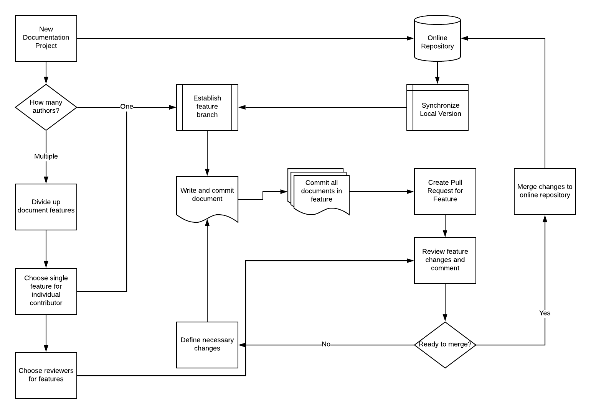

# Project: Process Instructions

## Process: Version Control in Technical writing

Git is a system of version control that preserves a timeline of edits of a file in a line-by-line format with comments and authorship, similar to systems used in Microsoft Word and Google Docs. GitHub and GitLab are repository websites that allow online storage of a project for collaboration, similar to a cloud storage system.

## Audience

While the users of version control tend to be developers, the goal of this project is to make these tools accessible to writers who do not have software development experience, but will likely be collaborating with programmers.

## Purpose

The goal of this instruction is to make a commonly used resource available to technical writers to allow more streamlined participation in software projects. It focuses on using repositories as writing projects alone, but would also build the skills that allow developers to make in-line edits to software comments in projects that generate documentation automatically.

## Requirements

- Essentials of Git, command-line and GUI (Atom for examples)
- Feature branches and workflow
- Pull Requests

## Scenario

Rebecca is technical writer experienced with Microsoft Word and some Adobe Suite products, moving into a position that uses developer comments in code to generate documentation. She needs to understand why the markdown format is necessary to learn, what programs can be used for writing, and why this is appealing for collaborating with developers. She will also need to learn how edit and publish documents, as well as solicit feedback from developers and collaborators.

## Users and roles model

| User/job title | Role Description |
| -------------- | -------------- |
| Technical Writer | Has experience with other formats, may have used markdown in specific contexts, and is familiar with version history in the style of MS Word or Google Docs |
| Technical Writing Project Manager | Needs to coordinate a new project, delegate labor, and be able to observe the progress and exit history of documents, as well as posting edits and coordinating that the team all has the most current version of the project. |

## Business Process/Procedure

### Actor: Content writer
1. Receives feature assignment from Project Manager
2. Writes content for feature
3. Submits pull request for feature review

### Actor: Content Reviewer
1. Receives feature review assignment from Project Manager
2. Reviews pull request and posts comments

### Actor: Project Manager
1. Divides projects into appropriately chunked features
2. Assigns features to content writers
3. Assigns features to content reviewers
4. Reviews pull requests and reviewer comments to merge or recommend further editing

## Process/Procedure Model

## Task list/flowcharts

1. Assign features (Project Manager)
  a. Chunk project into modular features
  b. Assign writers to features
  c. Assign writers to review other features
  d. Evaluate reviewed pull requests to merge or edits
  e. Merge pull requests
2. Write content (Content Writer)
  a. Create feature branch
  b. Write content and comment on changes through commit messages
  c. Push feature to online repository
  d. Make pull request and tag reviewer
3. Review Content (Content Reviewer)
  a. Receive review assignment
  b. Get notified of pull request by tag
  c. Review content, changes, and commit messages
  d. Post comments on pull request and recommendation for merge or edits.
